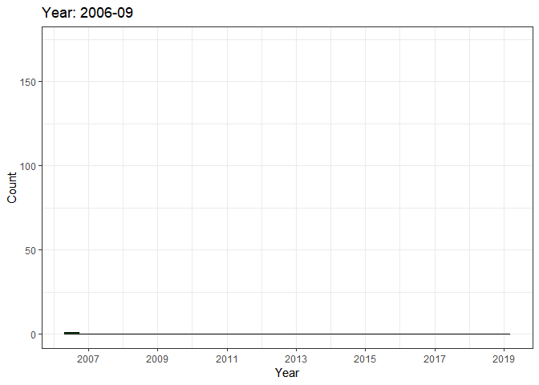
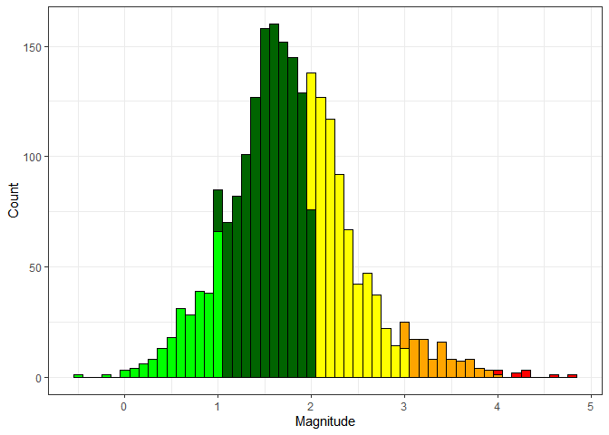
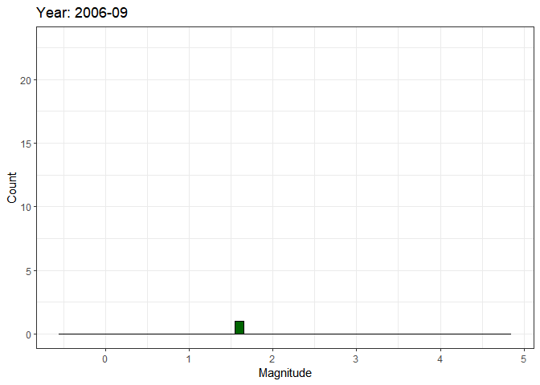
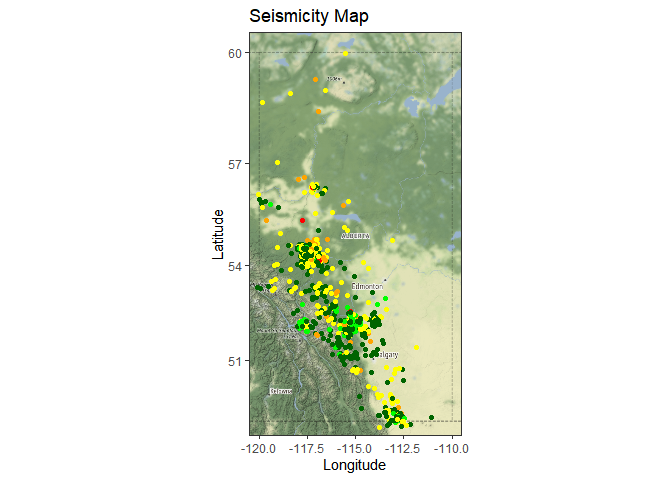
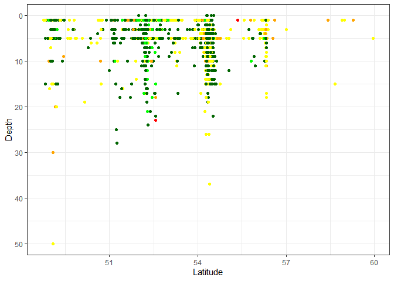
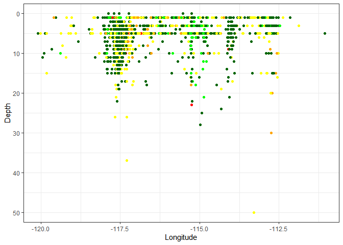
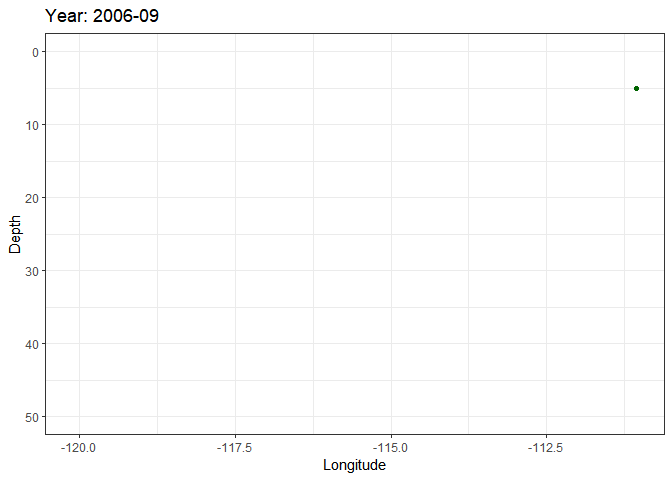

`Induced seismicity` refers to typically minor earthquakes and tremors
that are caused by human activity that alters the stresses and strains
on the Earth’s crust. Most induced seismicity is of a low magnitude
(**wikipedia**). For more details visit
[here](https://ags.aer.ca/activities/induced-seismicity).

This package includes the codes and raw data to evaluate Earthquakes in
Alberta. Raw data has been gathered from public data available in [AER
website](https://www.aer.ca/).

Data Prepration
---------------

We need to install below libraries for this analysis:

    require(maptools)
    require(rgdal)
    require(ggplot2)
    require(gganimate)
    require(ggmap)
    require(scales) # for function date_format
    require(magick)
    require(tidyverse)

first we are Loading Alberta Earthquakes Data prepared in `csv` format.

      sdf <- read.csv('./csv files/Recent_AB_Earthquakes.csv')

Co-ordination has provided in **geographic coordinate system** consists
of latitude and longitude. we need to convert them to **UTM** (Universal
Transverse Mercator) system. This function provide this conversion.

      LongLatToUTM <- function(x,y)
        {
          require(sp)
          zone <- 31+(x%/%6)
          xy <- data.frame(ID = 1:length(x), X = x, Y = y)
          coordinates(xy) <- c("X", "Y")
          proj4string(xy) <- CRS("+proj=longlat +datum=NAD83")
          res <- spTransform(xy, CRS(paste("+proj=utm +zone=",zone," ellps=NAD83",sep='')))
          results <- merge(zone,as.data.frame(res))
          return(results)
        }

Apply this conversion on loaded data

      utm <- mapply(LongLatToUTM,sdf$LON,sdf$LAT)

      UTM <- data.frame(matrix(unlist(utm), nrow=2225, byrow=T),stringsAsFactors=FALSE)
      UTM[2] <- NULL
      colnames(UTM)[1] = "Zone"
      colnames(UTM)[3] = "Northing"
      colnames(UTM)[2] = "Easting"
      
      sdf<-cbind(sdf,UTM)
      sdf$Easting=sdf$Easting/1000
      sdf$Northing=sdf$Northing/1000

here we need to convert date column to the format as `(mm/dd/yyyy)`

      #converting date
      sdf$DATETIME_ <- as.Date(sdf$DATETIME_,"%m/%d/%Y")
      
      sdf$year_month=paste(as.character(sdf$YEAR_),"/",as.character(sdf$MONTH_),"/1",sep="") #"/",toString(sdf$MONTH_),"/","1")
      sdf$year_month<- as.Date(sdf$year_month,"%Y/%m/%d")

To identify the intensity of earthquake, we convert its magnitude to
traffic light system

      sdf$traffic_light<-cut(sdf$MAG, breaks = c(-Inf, 2, 4, Inf), labels=c("Green", "Yellow", "Red"),include.lowest = TRUE)
      
      sdf$ID <- seq.int(nrow(sdf))
      
      write.csv(sdf,"'./csv files/prepared-sdf.csv")

here we are generating UTM based shape files for the flavored area

      leducreefs <- readShapePoly("./shape files/WCSB_ATLAS_1994_LEDUC_REEF_OUTLINE.shp")
      leducreefs.points <- fortify(leducreefs)

      UTM2<-LongLatToUTM(leducreefs.points$long,leducreefs.points$lat)

      # Adding the Easting and Northing to the datbase

      leducreefs.points$Easting<-UTM2[[2]]/1000
      leducreefs.points$Northing<-UTM2[[3]]/1000

      #swanhillsreefs.points <- fortify(swanhillsreefs)

      UTM.base.map<- geom_polygon(aes(x = Easting,
                       y = Northing,
                       group = group),
                   data = leducreefs.points,
                   color = "lightblue",
                   fill = "lightblue",
                   alpha = 0.3) 

Data Visualization
------------------

    ## [1] TRUE

First we consider the number of earthquake regarding each year and
display their distribution in a histogram

      count_by_year <- ggplot(data= sdf, aes(x =DATETIME_,  ..count..,fill=factor(sdf$traffic_light_kaush,levels=c("Red","Orange", "Yellow","DarkGreen","LightGreen"))))+
      geom_histogram( color="black")+
      xlab("Year") + ylab("Count") +
      scale_color_brewer(palette = "Spectral") +
      scale_x_date(breaks = date_breaks("2 year"),labels = date_format("%Y")) +theme_bw()+
      scale_fill_manual(values = c("LightGreen" = "green","DarkGreen"="darkgreen", "Yellow" = "yellow","Orange" = "orange","Red" = "red"),name = "Traffic Light System:    ")+
      theme(legend.position="none")
      count_by_year

In second part we will visualize these variations based on the monthly
records

      count_by_year_anim <- count_by_year +transition_time(sdf$year_month)+shadow_mark() +labs(title = "Year: {substr(frame_time,1,7)}")

      #count_by_year_anim

      anim1 = animate(count_by_year_anim,nframes=length(unique(sdf$year_month)), fps=4)

      anim1

Then we will display the magnitude of earthquakes on a histogram

      mag_by_year <-ggplot(data= sdf, aes(x = MAG ,  ..count..,fill=factor(sdf$traffic_light_kaush,levels=c("Red","Orange", "Yellow", "DarkGreen","LightGreen"))))+
      geom_histogram(colour='black',binwidth = 0.1)+
      xlab("Magnitude") + ylab("Count") +
      scale_color_brewer(palette = "Spectral") +
      scale_fill_manual(values = c("LightGreen" = "green","DarkGreen"="darkgreen", "Yellow" = "yellow","Orange" = "orange","Red" = "red"),name = "Traffic Light System:    ")+
      theme_bw()+theme(legend.position="none")

      mag_by_year

Then we will display the magnitude of earthquakes as an animated gif
based on monthly records

      mag_by_year_anim <- mag_by_year +transition_time(sdf$year_month) +labs(title = "Year: {substr(frame_time,1,7)}")

      #mag_by_year_anim

      anim2=animate(mag_by_year_anim,nframes=length(unique(sdf$year_month)), fps=4)

      anim2

Now we will display seismicity data on Alberta map during different year

      #Alberta Map
      Alberta <- get_map(location = c(-120.5,48.5,-109.5,60.5), source = 'google', maptype =  "terrain",zoom=6)
      LL_seismicity_map <- ggmap(Alberta)+
      geom_point(data=sdf,aes(x=sdf$LON, y=sdf$LAT, color=factor(sdf$traffic_light_kaush,levels=c("Red","Orange", "Yellow", "DarkGreen","LightGreen"))))+
      labs(title="Seismicity Map", x="Longitude", y="Latitude")+
      scale_color_manual(values = c("LightGreen" = "green","DarkGreen"="darkgreen", "Yellow" = "yellow","Orange" = "orange","Red" = "red"),name = "Traffic Light System:    ")+
      theme_bw()+theme(legend.position="none")#+
      #geom_point(aes(x=-117.5,y=54.5),size = 20, pch = 1)+#almost Fox Creek Lat/Long
      #geom_point(aes(x=-115,y=52.5),size = 20, pch = 1)#almost Rocky MOuntain House Lat/Long
      #geom_point(aes(x=-116.8089,y=54.4022),size = 20, pch = 1)+#exact Fox Creek Lat/Long
      #geom_point(aes(x=-114.9183,y=52.3793),size = 20, pch = 1)#exact Rocky MOuntain House Lat/Long

      LL_seismicity_map

and these data will be animated on monthly based

      LL_seismicity_anim <- LL_seismicity_map +  
      transition_time(as.Date(sdf$year_month)) +
      labs(title = "Year: {substr(frame_time,1,7)}")+
      ease_aes('linear')  

      #LL_seismicity_anim

      anim3 = animate(LL_seismicity_anim,nframes=length(unique(as.Date(sdf$year_month))), fps=4)

      anim3

      depth_lat_mag <- ggplot()+
      geom_point(data=sdf,aes(x=sdf$LAT, y=sdf$DEPTH, color=factor(sdf$traffic_light_kaush,levels=c("Red","Orange", "Yellow", "DarkGreen","LightGreen"))))+
      labs(x="Latitude", y="Depth")+
      scale_color_manual(values = c("LightGreen" = "green","DarkGreen"="darkgreen", "Yellow" = "yellow","Orange" = "orange","Red" = "red"),name = "Traffic Light System:    ")+
      theme_bw()+theme(legend.position="none")+
      scale_y_continuous(trans = "reverse")#+
      #geom_vline(xintercept = 52.5, linetype="solid", 
                # color = "blue", size=20, alpha=0.1)+
      #geom_vline(xintercept = 54.5, linetype="solid", 
                # color = "blue", size=20, alpha=0.1)

      depth_lat_mag

      depth_lat_mag_anim<-depth_lat_mag +  
      transition_time(sdf$DATETIME_) +transition_time(sdf$year_month) +labs(title = "Year: {substr(frame_time,1,7)}")

      anim4=animate(depth_lat_mag_anim,nframes=length(unique(sdf$year_month)), fps=4)

      anim4

      depth_long_mag <- ggplot()+
      geom_point(data=sdf,aes(x=sdf$LON, y=sdf$DEPTH, color=factor(sdf$traffic_light_kaush,levels=c("Red","Orange", "Yellow", "DarkGreen","LightGreen"))))+
      labs( x="Longitude", y="Depth")+
      scale_color_manual(values = c("LightGreen" = "green","DarkGreen"="darkgreen", "Yellow" = "yellow","Orange" = "orange","Red" = "red"),name = "Traffic Light System:    ")+
      theme_bw()+theme(legend.position="none")+
      scale_y_continuous(trans = "reverse")#+
      #geom_vline(xintercept = -117.5, linetype="solid", 
                # color = "blue", size=20, alpha=0.1)+
      #geom_vline(xintercept = -115, linetype="solid", 
               #  color = "blue", size=20, alpha=0.1)

      
      #geom_point(aes(x=-116.8089,y=54.4022),size = 20, pch = 1)+#Fox Creek Lat/Long
      #geom_point(aes(x=-114.9183,y=52.3793),size = 20, pch = 1)#Rocky MOuntain House Lat/Long
      

      depth_long_mag

      depth_long_mag_anim <-depth_long_mag +  
      transition_time(sdf$DATETIME_) +transition_time(sdf$year_month) +labs(title = "Year: {substr(frame_time,1,7)}")

      anim5=animate(depth_long_mag_anim,nframes=length(unique(sdf$year_month)), fps=4)

      anim5

